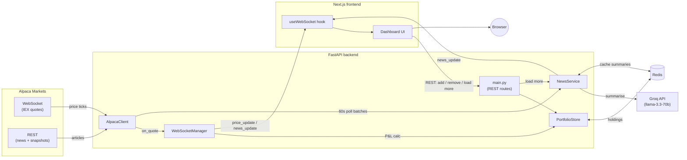

# PortfolioLive

A real-time portfolio dashboard: live stock prices, live P&L, and
AI-summarised news, filtered to whatever you hold.

## Architecture



One Alpaca WebSocket connection is shared across every holding and every
connected browser tab — prices come in once from Alpaca and fan out to N
clients, not N Alpaca connections. News is polled over REST every 60s
(not streamed), summarised one sentence at a time by Groq, cached in
Redis, and pushed to clients over the same WebSocket as price ticks.

Full rationale for every non-obvious decision in this codebase — why the
Alpaca stream runs on its own thread, why `useReducer` vs `useState`,
why the Docker `CMD` needs `exec`, and so on — is in
[`DECISION_LOG.md`](./DECISION_LOG.md), organised per commit.

## Features

- Live price ticks and per-position P&L ($ and %) over WebSocket, with the
  last-known price shown immediately on page load (not blank until the
  next tick)
- Portfolio table with a 20-point sparkline per holding
- Add / remove holdings, with optimistic UI updates
- AI-summarised news (one sentence, market-focused) per holding, with
  ticker tabs to filter and "Load more" to page further back in history
- Price alerts — set a target, get a toast when it crosses; fired alerts
  stay visible instead of disappearing
- Portfolio analytics (`/analytics`) — total return, 30-day P&L% history,
  best/worst performer (7d), a chart per holding
- Prometheus `/metrics` — active WebSocket connections, Groq call count,
  news cache hit/miss, summaries generated
- Single-user JWT login protecting every route except `/health`/`/metrics`
- Auto-reconnecting WebSocket client (exponential backoff, capped at 30s)

## Tech stack

| | |
|---|---|
| Backend | Python, FastAPI, WebSockets, Redis, [alpaca-py](https://github.com/alpacahq/alpaca-py) |
| Frontend | Next.js 15 (App Router), TypeScript, Tailwind CSS, Recharts |
| AI | Groq (`llama-3.3-70b-versatile`) for one-line news summaries |
| Data | Alpaca Markets (free tier — 15-minute delayed IEX feed) |
| Deploy | Railway (backend, via Docker), Vercel (frontend) |

## Project structure

```
backend/
  main.py               FastAPI app, routes, WS endpoint, lifespan wiring
  alpaca_client.py       Alpaca WebSocket price stream + REST news polling
  websocket_manager.py   Fans price ticks out to connected frontend clients
  news_service.py        Groq summarisation, caching, dedup, broadcast
  portfolio_store.py     Redis-backed holdings CRUD
  models.py              Pydantic models shared across the backend
  tests/                 pytest — model validation
  Dockerfile, railway.toml, .dockerignore
frontend/
  app/
    page.tsx              Dashboard: state, WebSocket wiring, layout
    components/
      PortfolioTable.tsx   Holdings table with live P&L + sparklines
      PriceSparkline.tsx   Mini Recharts line chart per holding
      NewsFeed.tsx         AI news feed with ticker tabs + load more
      AddTickerForm.tsx    Add-holding form (optimistic UI)
  lib/
    websocket.ts           useWebSocket hook (auto-reconnect)
    types.ts                Shared TypeScript types (mirrors backend/models.py)
    format.ts               Currency / percent / relative-time formatting
.github/workflows/ci.yml   Lint + test on every PR (backend + frontend)
DECISION_LOG.md            Every non-obvious decision, organised per commit
```

## Getting started

### Prerequisites

- Python 3.12, Node 20+ (Node 22 recommended — see note below)
- Redis (local install, or `docker run -p 6379:6379 redis:7-alpine`)
- API keys: [Alpaca](https://alpaca.markets) (free — paper trading tier
  covers everything this app needs) and [Groq](https://console.groq.com)

### Backend

```bash
cd backend
python3 -m venv .venv && source .venv/bin/activate
pip install -r requirements.txt
cp .env.example .env   # fill in ALPACA_API_KEY, ALPACA_SECRET_KEY, GROQ_API_KEY,
                        # AUTH_SECRET_KEY, AUTH_USERNAME, AUTH_PASSWORD
uvicorn main:app --reload
```

Runs on `http://localhost:8000`. `GET /health` should return `{"status": "ok"}`.

`AUTH_USERNAME`/`AUTH_PASSWORD` only take effect once — they seed the
single login account into Redis on first startup, not on every restart
(see `backend/auth.py`). `AUTH_SECRET_KEY` should be a long random string
(e.g. `python3 -c "import secrets; print(secrets.token_hex(32))"`); every
route except `/health` and `/metrics` requires a token from
`POST /auth/login` afterward.

To also run the linter/tests locally:

```bash
pip install -r requirements-dev.txt
ruff check .
pytest
```

### Frontend

```bash
cd frontend
npm install
cp .env.local.example .env.local   # defaults already point at localhost:8000
npm run dev
```

Runs on `http://localhost:3000`.

> **Node version note:** `eslint-visitor-keys` requires Node `^20.19 ||
> ^22.13 || >=24`. Older Node 20.x patch versions will `npm install`
> successfully but print an `EBADENGINE` warning — harmless locally, but
> CI pins Node 22 specifically to avoid it.

### Docker (backend only)

```bash
cd backend
docker build -t portfoliolive-backend .
docker run -p 8000:8000 --env-file .env portfoliolive-backend
```

Note `REDIS_URL` inside `.env` needs to be reachable *from the
container* — `redis://host.docker.internal:6379` if Redis is running on
your host machine, not `localhost`.

## API reference

Every route below except `/health`, `/metrics`, and `/auth/login` requires
`Authorization: Bearer <token>` (the WebSocket takes it as `?token=`
instead — browsers can't set custom headers on a WS handshake).

| Method | Path | Description |
|---|---|---|
| `GET` | `/health` | Health check (unauthenticated) |
| `GET` | `/metrics` | Prometheus metrics (unauthenticated) |
| `POST` | `/auth/login` | `{username, password}` → `{access_token, token_type}` |
| `GET` | `/portfolio` | Current holdings, with last-known price if available |
| `POST` | `/portfolio/add` | Add/update a holding (`{ticker, quantity, avg_cost}`) |
| `DELETE` | `/portfolio/{ticker}` | Remove a holding (and its alerts) |
| `GET` | `/news/{ticker}?before=&limit=` | Page further back into a ticker's news |
| `GET` | `/alerts` | List price alerts |
| `POST` | `/alerts` | Create an alert (`{ticker, target_price}`) — ticker must be held |
| `DELETE` | `/alerts/{alert_id}` | Remove an alert |
| `GET` | `/analytics?days=` | Total return, P&L history, best/worst performer (7d) |
| `WS` | `/ws?token=` | Live `price_update` / `news_update` / `price_alert` events |

## Known constraints

- **15-minute delayed data.** Alpaca's free tier uses the IEX feed, not
  full SIP — fine for a dashboard, not for trading decisions.
- **US-listed equities only.** A consequence of using Alpaca's *stock*
  data endpoints specifically (`StockDataStream`, stock news) — Alpaca
  also has crypto data, but this app doesn't touch it. Ticker validation
  itself doesn't enforce this; an invalid or unsupported ticker just sits
  with `—` placeholders forever, since it's subscribed but never receives
  data.
- **News has no replay for late-joining clients.** Broadcasts are
  push-only — a client that connects after a ticker's news has already
  gone out over the socket won't see it until either new articles appear
  or the backend restarts (which clears the in-process dedup set).
- **Sparklines don't persist across reloads.** Price history is
  accumulated client-side from live ticks only, not seeded from
  historical bars — reloading the page empties it back to zero.
- **Groq's free tier has rate limits** — the 5-minute Redis cache on
  news summaries exists specifically to avoid redundant calls for
  articles already summarised.

## Security

- Single-user JWT login (`backend/auth.py`) protects every route except
  `/health`/`/metrics`/`/auth/login` — bearer token for REST, `?token=`
  query param for the WebSocket handshake (browsers can't set custom
  headers there)
- Password hashed with bcrypt; credentials seeded from env vars once, not
  via an open registration endpoint
- API keys are backend-only, read from environment variables, never
  exposed to the frontend
- CORS restricted to a single configured `FRONTEND_ORIGIN`
- Ticker input validated (uppercase letters, 1–5 chars) on both frontend
  and backend
- `/portfolio/add` capped at 50 holdings total
