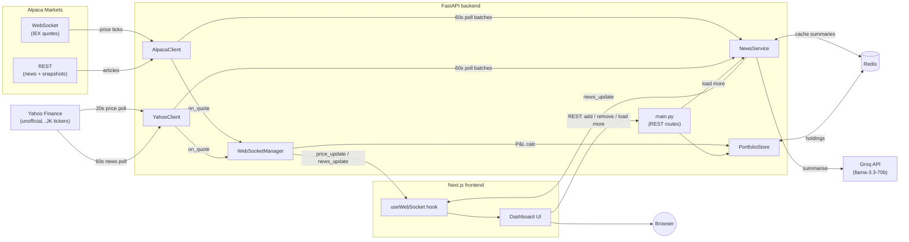

# PortfolioLive

A real-time portfolio dashboard: live stock prices, live P&L, AI-summarised
news, price alerts, a watchlist, and performance analytics — behind a
single-user login, all on top of one shared WebSocket connection. Covers
both US equities (Alpaca) and Indonesian stocks (Yahoo Finance, `.JK`
tickers), with USD/IDR totals kept separate rather than FX-converted.
Installable as a PWA, with a mobile card layout so it's usable from a
phone, not just a desktop tab.

## Architecture



One Alpaca WebSocket connection is shared across every US holding and
every connected browser tab — prices come in once from Alpaca and fan
out to N clients, not N Alpaca connections. Indonesian (`.JK`) tickers
route to a separate `YahooClient` instead (no Alpaca coverage there),
polled every 20s rather than pushed, since Yahoo's free/unofficial data
has no streaming feed — but both clients feed the exact same
`on_quote(ticker, price)` callback into `WebSocketManager`, which is
itself source-agnostic. News works the same way: both Alpaca (US
tickers) and `YahooClient` (`.JK` tickers) poll over REST every 60s and
feed the same `NewsService` batch-handling pipeline — summarised one
sentence at a time by Groq, cached in Redis, deduplicated, and pushed to
clients over the same WebSocket as price ticks, regardless of source.

Full rationale for every non-obvious decision in this codebase — why the
Alpaca stream runs on its own thread, why `useReducer` vs `useState`,
why the Docker `CMD` needs `exec`, and so on — is in
[`DECISION_LOG.md`](./DECISION_LOG.md), organised per commit.

## Features

- Live price ticks and per-position P&L ($ and %) over WebSocket, with the
  last-known price shown immediately on page load (not blank until the
  next tick)
- Portfolio table with a 20-point sparkline per holding
- Add / remove holdings, with optimistic UI updates
- Watchlist — track a ticker's live price and news without owning it;
  doesn't count toward P&L, auto-migrates to your holdings if you buy it
- AI-summarised news (one sentence, market-focused) per holding or
  watchlist ticker — both US (Alpaca) and Indonesian (Yahoo Finance)
  tickers — with ticker tabs to filter and "Load more" to page further
  back in history
- Price alerts (on holdings or watchlist tickers) — set a target, get a
  toast when it crosses; fired alerts stay visible instead of disappearing
- Portfolio analytics (`/analytics`) — total return, 30-day P&L% history,
  best/worst performer (7d), a chart per holding
- Prometheus `/metrics` — active WebSocket connections, Groq call count,
  news cache hit/miss, summaries generated
- Single-user JWT login protecting every route except `/health`/`/metrics`
- Auto-reconnecting WebSocket client (exponential backoff, capped at 30s)
- Broadcasts are throttled to at most once per ticker per second — quote
  ticks can arrive several times a second, and alerts still see every raw
  tick (so a brief threshold crossing is never missed), but the UI only
  needs a steady cadence, not every microstructure flicker
- Indonesian stocks (IDX, `.JK` tickers e.g. `BBCA.JK`) alongside US
  equities — priced in IDR, polled from Yahoo Finance every 20s; Total
  Value/P&L and analytics are shown as separate USD and IDR totals, not
  FX-converted into one number
- Installable PWA (manifest + icons + a minimal service worker for
  Android/Chrome's install prompt; iOS uses Safari's manual "Add to
  Home Screen") and a mobile card layout for the holdings/watchlist
  tables below the `sm` breakpoint, instead of requiring horizontal
  scroll to reach P&L/Alert/Remove
- Real push notifications (Web Push/VAPID) when a price alert fires —
  arrives even with the app closed, opt-in via a header toggle. Chrome/
  Edge (desktop + Android) only; no Safari/iOS support for the Push API
- An app icon badge showing the number of fired-but-not-yet-cleared
  alerts (Badging API — Chrome/Edge desktop + Android only, no Safari/
  iOS support)
- A daily digest push (default 07:00 WIB, `DIGEST_HOUR_UTC`) summarising
  today's price move per tracked ticker

## Tech stack

| | |
|---|---|
| Backend | Python, FastAPI, WebSockets, Redis, [alpaca-py](https://github.com/alpacahq/alpaca-py) |
| Frontend | Next.js 15 (App Router), TypeScript, Tailwind CSS, Recharts |
| AI | Groq (`llama-3.3-70b-versatile`) for one-line news summaries |
| Data | Alpaca Markets (free tier — real-time IEX exchange feed, not consolidated NBBO, US equities); Yahoo Finance (unofficial, `.JK` Indonesia tickers, via [`yfinance`](https://github.com/ranaroussi/yfinance)) |
| Deploy | Backend: a free-tier Google Cloud e2-micro VM, running the same Docker image as local dev, with [Caddy](https://caddyserver.com) reverse-proxying HTTPS (auto-provisioned Let's Encrypt cert via [nip.io](https://nip.io), since there's no purchased domain). Frontend: Vercel. `backend/railway.toml` is kept for Railway as an alternative, but its free tier ($1/month credit after a one-time trial) isn't enough to run a backend + Redis continuously — see commit 32. |

## Project structure

```
backend/
  main.py                 FastAPI app, routes, WS endpoint, lifespan wiring
  alpaca_client.py        Alpaca WebSocket price stream + REST news polling
  yahoo_client.py         Yahoo Finance REST polling for Indonesia (.JK) tickers
  websocket_manager.py    Fans price ticks out to connected frontend clients
  news_service.py         Groq summarisation, caching, dedup, broadcast
  portfolio_store.py      Redis-backed holdings CRUD
  watchlist_store.py      Redis-backed watched-ticker CRUD
  alert_store.py          Redis-backed price alert CRUD
  alert_service.py        Threshold-crossing detection on live ticks + push
  analytics_service.py    Hourly portfolio snapshots + P&L history/analytics
  auth.py                 Single-user JWT auth (bootstrap, login, verify)
  metrics.py              Prometheus counters/gauges (shared registry)
  models.py               Pydantic models shared across the backend
  push_store.py           Redis-backed Web Push subscription storage
  push_service.py         VAPID-signed push sending (pywebpush) + cleanup
  digest_service.py       Daily price-move push, same scheduled-loop shape as news polling
  tests/                  pytest — models, auth, alerts, push, digest, WebSocket fan-out
  Dockerfile, railway.toml, .dockerignore
frontend/
  app/
    page.tsx                        Dashboard: state, WebSocket wiring, layout
    login/page.tsx                  Login form
    analytics/page.tsx              Portfolio analytics charts
    icon.png                        Favicon + PWA icon (Next.js App Router convention)
    components/
      PortfolioTable.tsx            Holdings table with live P&L + sparklines (+ mobile card view)
      Watchlist.tsx                 Watchlist table with live price + change (+ mobile card view)
      PriceSparkline.tsx            Mini Recharts line chart per holding
      NewsFeed.tsx                  AI news feed with ticker tabs + load more
      AddTickerForm.tsx             Add-holding form (optimistic UI)
      Toast.tsx                     Alert-triggered toast notifications
      ServiceWorkerRegistration.tsx Registers public/sw.js on mount
      NotificationToggle.tsx        Push notification opt-in/out toggle
  public/
    manifest.json                   PWA manifest (name, icons, standalone display)
    sw.js                           Service worker — static-asset cache + push/notificationclick, never API/WS
    icons/                          192/512/maskable/apple-touch-icon PNGs
  lib/
    websocket.ts  useWebSocket hook (auto-reconnect)
    auth.ts       authFetch wrapper + useRequireAuth login gate
    push.ts       Web Push subscribe/unsubscribe (PushManager, VAPID key conversion)
    types.ts      Shared TypeScript types (mirrors backend/models.py)
    format.ts     Currency / percent / relative-time formatting
.github/workflows/ci.yml  Lint + test on every PR (backend + frontend)
DECISION_LOG.md           Every non-obvious decision, organised per commit
```

## Getting started

### Prerequisites

- Python 3.12, Node 20+ (Node 22 recommended — see note below)
- Redis (local install, or `docker run -p 6379:6379 redis:7-alpine`)
- API keys: [Alpaca](https://alpaca.markets) (free — paper trading tier
  covers everything this app needs) and [Groq](https://console.groq.com)

### Backend

```bash
cd backend
python3 -m venv .venv && source .venv/bin/activate
pip install -r requirements.txt
cp .env.example .env   # fill in ALPACA_API_KEY, ALPACA_SECRET_KEY, GROQ_API_KEY,
                        # AUTH_SECRET_KEY, AUTH_USERNAME, AUTH_PASSWORD
uvicorn main:app --reload
```

Runs on `http://localhost:8000`. `GET /health` should return `{"status": "ok"}`.

`AUTH_USERNAME`/`AUTH_PASSWORD` only take effect once — they seed the
single login account into Redis on first startup, not on every restart
(see `backend/auth.py`). `AUTH_SECRET_KEY` should be a long random string
(e.g. `python3 -c "import secrets; print(secrets.token_hex(32))"`); every
route except `/health` and `/metrics` requires a token from
`POST /auth/login` afterward.

To also run the linter/tests locally:

```bash
pip install -r requirements-dev.txt
ruff check .
pytest
```

### Frontend

```bash
cd frontend
npm install
cp .env.local.example .env.local   # defaults already point at localhost:8000
npm run dev
```

Runs on `http://localhost:3000`.

> **Node version note:** `eslint-visitor-keys` requires Node `^20.19 ||
> ^22.13 || >=24`. Older Node 20.x patch versions will `npm install`
> successfully but print an `EBADENGINE` warning — harmless locally, but
> CI pins Node 22 specifically to avoid it.

### Docker (backend only)

```bash
cd backend
docker build -t portfoliolive-backend .
docker run -p 8000:8000 --env-file .env portfoliolive-backend
```

Note `REDIS_URL` inside `.env` needs to be reachable *from the
container* — `redis://host.docker.internal:6379` if Redis is running on
your host machine, not `localhost`.

## API reference

Every route below except `/health`, `/metrics`, and `/auth/login` requires
`Authorization: Bearer <token>` (the WebSocket takes it as `?token=`
instead — browsers can't set custom headers on a WS handshake).

| Method | Path | Description |
|---|---|---|
| `GET` | `/health` | Health check (unauthenticated) |
| `GET` | `/metrics` | Prometheus metrics (unauthenticated) |
| `POST` | `/auth/login` | `{username, password}` → `{access_token, token_type}` |
| `GET` | `/portfolio` | Current holdings, with last-known price if available |
| `POST` | `/portfolio/add` | Add/update a holding (`{ticker, quantity, avg_cost}`) — removes it from the watchlist if present |
| `DELETE` | `/portfolio/{ticker}` | Remove a holding (and its alerts) |
| `GET` | `/watchlist` | Watched tickers, with last-known price/change if available |
| `POST` | `/watchlist/add` | Watch a ticker (`{ticker}`) — must not already be a holding |
| `DELETE` | `/watchlist/{ticker}` | Stop watching a ticker (and its alerts) |
| `GET` | `/news/{ticker}?before=&limit=` | Page further back into a ticker's news |
| `GET` | `/alerts` | List price alerts |
| `POST` | `/alerts` | Create an alert (`{ticker, target_price}`) — ticker must be a holding or watched |
| `DELETE` | `/alerts/{alert_id}` | Remove an alert |
| `GET` | `/analytics?days=` | Total return, P&L history, best/worst performer (7d) |
| `POST` | `/push/subscribe` | Register a browser's Web Push subscription (`{endpoint, keys: {p256dh, auth}}`) |
| `DELETE` | `/push/subscribe?endpoint=` | Remove a Web Push subscription |
| `WS` | `/ws?token=` | Live `price_update` / `watchlist_price_update` / `news_update` / `price_alert` events |

## Known constraints

- **The backend's HTTPS cert is tied to its IP via nip.io, not a real
  domain.** If the VM is ever recreated (a new external IP), the
  Caddyfile's hostname and every `NEXT_PUBLIC_API_URL`/
  `NEXT_PUBLIC_WS_URL` reference need updating together — there's no
  DNS indirection cushioning that today. A real domain would remove
  this coupling if the project outgrows the free-tier setup.
- **The service worker (`public/sw.js`) only *caches* static assets, on
  purpose** — it also now handles `push`/`notificationclick` events
  (unrelated to caching), but its `fetch` handler still never touches
  `/portfolio`, `/watchlist`, `/alerts`, `/analytics`, `/news/*`, or the
  WebSocket connection. Offline just means the app shell loads and then
  shows whatever `useWebSocket`'s disconnected/reconnecting state looks
  like, not stale data presented as live.
- **Push notifications and the app icon badge have no Safari/iOS
  support** — both are real platform gaps (the Push API and Badging
  API respectively), not bugs. They work on Chrome/Edge, desktop and
  Android.
- **True end-to-end push delivery could only be verified with a visible
  (non-headless) browser window in this environment** — headless real
  Chrome successfully subscribed and the backend successfully sent (no
  errors, real HTTP 2xx from the push service), but the push never
  reached the service worker's `push` event specifically in headless
  mode. Appears to be a Chrome headless-mode limitation around
  background push delivery, not an application bug — worth knowing if
  push notifications are ever automated-tested again.
- **Single-exchange (IEX) data, not consolidated (US tickers).** Alpaca's
  free tier is real-time, not delayed — but it's IEX's own book only
  (~2-3% of US equity volume), not the consolidated NBBO other quote
  sources show. Prices can differ slightly from what you'd see
  elsewhere at the same instant; fine for a dashboard, not for trading
  decisions.
- **US equities and Indonesian (IDX) stocks only.** A consequence of
  using Alpaca's *stock* data endpoints specifically (Alpaca also has
  crypto data, untouched here) plus Yahoo Finance's `.JK`-suffixed
  quotes for Indonesia. Ticker validation itself doesn't enforce
  anything beyond the `[A-Z]{1,5}` / `[A-Z]{1,5}.JK` shape; a
  syntactically valid but unsupported/delisted ticker just sits with `—`
  placeholders forever, since it's subscribed but never receives data.
- **Yahoo Finance's `.JK` data is unofficial and polled, not pushed.**
  There's no free/public streaming feed for it, so Indonesian prices
  update on a 20s cycle (`yahoo_client.py`) rather than near-instantly
  like Alpaca's WebSocket — and being unofficial, it carries more
  reliability/ToS risk than Alpaca's licensed feed. Fine for a personal
  dashboard, not a guarantee for anything more serious.
- **USD and IDR totals are shown separately, never combined.** Total
  Value/P&L (dashboard header, analytics) render one block per currency
  present rather than one FX-converted number — a deliberate choice, not
  a missing feature.
- **Indonesian news is English-language market coverage, not local
  reporting.** Yahoo Finance's `.JK` news (`yahoo_client.py`) surfaces
  things like Zacks-style comparison pieces, not Indonesian-language
  financial journalism — real and usable, just not the same character
  as what a local IDX news source would give you. It also can't be
  paged as far back as US tickers can: yfinance's news endpoint takes
  only a result count, no date cursor, so "Load more" for a `.JK`
  ticker runs out of new results sooner than the equivalent US one.
- **News has no replay for late-joining clients.** Broadcasts are
  push-only — a client that connects after a ticker's news has already
  gone out over the socket won't see it until either new articles appear
  or the backend restarts (which clears the in-process dedup set).
- **Sparklines don't persist across reloads.** Price history is
  accumulated client-side from live ticks only, not seeded from
  historical bars — reloading the page empties it back to zero.
- **Groq's free tier has rate limits** — the 5-minute Redis cache on
  news summaries exists specifically to avoid redundant calls for
  articles already summarised.

## Security

- Single-user JWT login (`backend/auth.py`) protects every route except
  `/health`/`/metrics`/`/auth/login` — bearer token for REST, `?token=`
  query param for the WebSocket handshake (browsers can't set custom
  headers there)
- Password hashed with bcrypt; credentials seeded from env vars once, not
  via an open registration endpoint
- API keys are backend-only, read from environment variables, never
  exposed to the frontend
- CORS restricted to a single configured `FRONTEND_ORIGIN`
- Ticker input validated (uppercase letters, 1–5 chars, optionally
  suffixed with `.JK`) on both frontend and backend
- `/portfolio/add` capped at 50 holdings total
